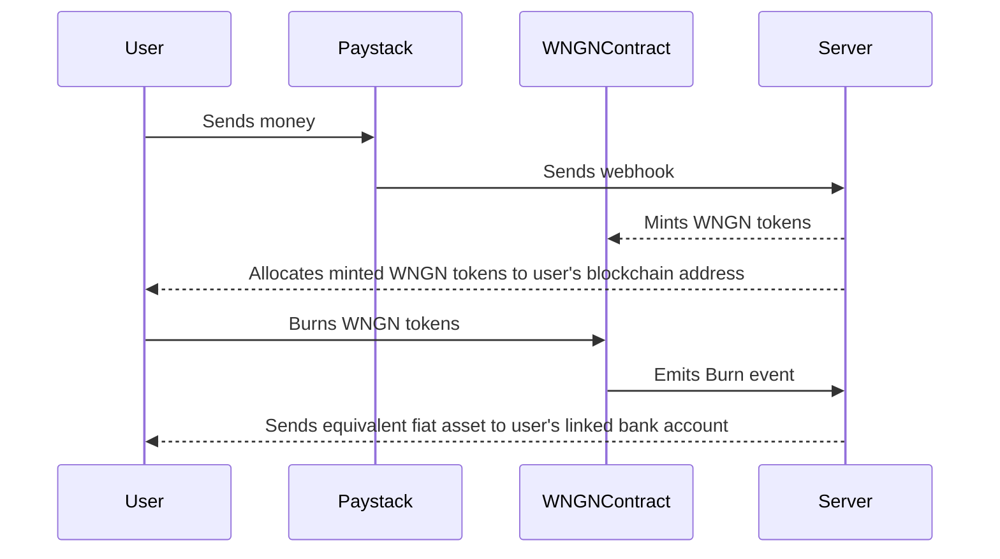
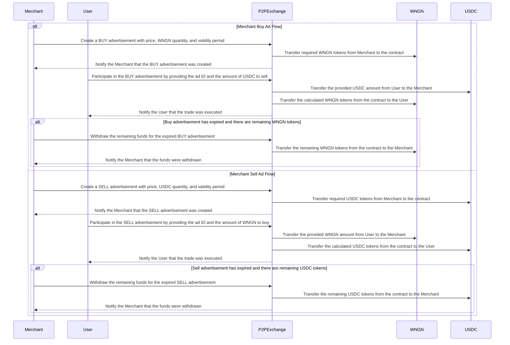

# Wrapped Naira

This project provides a seamless fiat-to-crypto ramp, allowing users to easily convert Nigerian Naira (NGN) into a stablecoin ERC20 token. It also features a peer-to-peer exchange platform where merchants can list offers, and interested buyers can participate. The process is straightforward - users deposit NGN via a payment processor like Paystack, and the equivalent token amount is minted. The tokens are burned for withdrawals, and the corresponding fiat is sent back to the user's linked bank account. Crucially, the project ensures 1:1 backing of all funds, providing transparency and security.

## Folder Structure

```sh
.
├── README.md
├── afang (Subgraph files and configurations)
├── miyan (Solidity smart contracts)
├── ukwa (Node.js backend API)
└── wara (TypeScript React frontend)
```

## Architecture



## Utilities

- **Peer-to-peer stablecoin exchange**: This platform allows users to trade the WNGN token directly with each other, facilitating the growth of the token's liquidity. As the project gains more traction, liquidity pools will be created on popular decentralized exchanges (DEXes) to further improve the token's liquidity.



## Deployment Addresses

### 1. WNGN Token

- Scroll Sepolia - [0xaf97c3478abf6eeac933d3383b71668f314400aa](https://sepolia.scrollscan.com/address/0xaf97c3478abf6eeac933d3383b71668f314400aa)

- Scroll Mainnet - Coming soon 🚀

### 2. P2P Contract

- Scroll Sepolia - [0x3e3ff6bd166aca5837e3df8419991b3905c28fa2](https://sepolia.scrollscan.com/address/0x3e3ff6bd166aca5837e3df8419991b3905c28fa2)

- Scroll Mainnet - Coming soon 🚀

## API

### Technologies Used

- [Viem](https://viem.sh/)
- [Honojs](https://hono.dev/)
- [Supabase](https://supabase.com/)
- [Trigger.dev](https://trigger.dev/)
- [Subgraph](https://thegraph.com/en/)
- [Drizzle ORM](https://orm.drizzle.team/)
- [Cloudflare for deployment](https://www.cloudflare.com)

### URL

Backend is live @ [https://ukwa.ienioladewumi.workers.dev/](https://ukwa.ienioladewumi.workers.dev/) ✨


## Challenges Faced

During the development of this project, we encountered several obstacles related to the deployment of the subgraph. Despite multiple attempts, the subgraph deployment consistently failed, hindering our progress.

The first issue we faced was related to IPFS deployment. To overcome this hurdle, we utilized the Satsuma IPFS URL as an alternative solution. However, this workaround did not completely resolve the deployment problems.

Subsequently, we encountered difficulties when attempting to deploy the subgraph to the node. As a potential solution, we explored the possibility of switching to Alchemy's node, as they offer support for subgraphs. Unfortunately, as at the time of the hackathon, Alchemy did not provide support for the Scroll zkEVM blockchain, which was the platform we were targeting.
****
